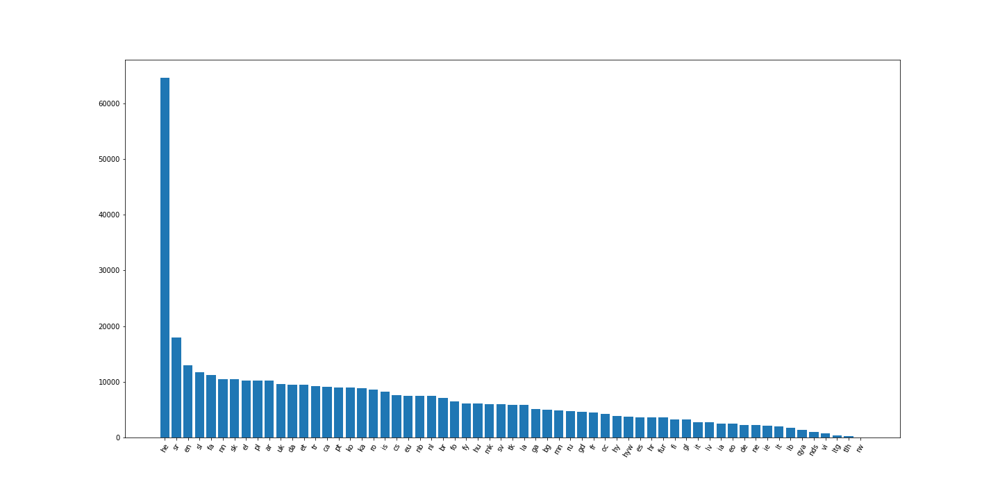

# Wordle Global
Open Source Wordle in a bunch of languages
- [ ] manually make keyboards for top languages
- [ ] add klingon (and other meme languages)
- [ ] go over and improve word lists
- [ ] move to plausible

## PULL REQUESTS WELCOME!

It would be mega awesome if you could help in any way (especially with language curation).

**How to add a new language:**
1. Make a folder in webapp/data/languages/ with the language code (e.g. en, de, fr, es. You can also go longer if needed)
2. Add a list of 5-letter words and call it {lang_code}_5words.txt
    1. (Optional) Add a language_config.json file
    2. (Optional) Add a list of supplemental words
3. Add your new language to the list at webapp/data/languages.json

Voilà!

## TODOs
- [ ] take into account browser bar height on mobile
- [ ] curate wordlists for existing languages
- [ ] add keyboard layouts for existing languages
- [ ] add more languages

Potential improvements:
- [ ] nice animations for revealing letters & such
- [ ] make a 4, 6, 7 letter version

Nice to haves:
- [ ] improve code quality (e.g. make variable names consistent)
- [ ] properly integrate TailwindCSS and Vue.js (i.e. not from CDN)

## Status of Languages
```
  - Interlingue (ie):              🟨 (1669 words)
  - Korean (ko):                   🟨 (8888 words)
  - Nepali (ne):                   🟥 (19 words)
  - Slovenian (sl):                🟨 (6814 words)
  - Dutch (nl):                    🟨 (2957 words)
  - Luxembourgish (lb):            🟥 (312 words)
  - Hungarian (hu):                🟨 (4605 words)
  - French (fr):                   🟨 (3374 words)
  - Occitan (oc):                  🟨 (3978 words)
  - English (en):                  🟩 (12948 words)
  - Interlingua (ia):              🟨 (2262 words)
  - Macedonian (mk):               🟨 (4127 words)
  - Irish (ga):                    🟨 (2844 words)
  - Turkish (tr):                  🟨 (6653 words)
  - Icelandic (is):                🟧 (633 words)
  - Italian (it):                  🟨 (1386 words)
  - Russian (ru):                  🟨 (3822 words)
  - Portuguese (pt):               🟨 (7090 words)
  - Spanish (es):                  🟨 (3030 words)
  - Latvian (lv):                  🟨 (2306 words)
  - Breton (br):                   🟨 (2254 words)
  - Catalan (ca):                  🟨 (6437 words)
  - Croatian (hr):                 🟨 (2933 words)
  - Estonian (et):                 🟨 (9578 words)
  - Latgalian (ltg):               🟥 (368 words)
  - Serbian (sr):                  🟥 (1 words)
  - Polish (pl):                   🟨 (5182 words)
  - Hebrew (he):                   🟨 (64476 words)
  - Vietnamese (vi):               🟥 (1 words)
  - Persian (fa):                  🟨 (7704 words)
  - Basque (eu):                   🟨 (5986 words)
  - Ukrainian (uk):                🟨 (4355 words)
  - Romanian (ro):                 🟨 (5023 words)
  - Fur (fur):                     🟨 (2591 words)
  - Western Frisian (fy):          🟥 (181 words)
  - Arabic (ar):                   🟨 (13883 words)
  - Turkmen (tk):                  🟨 (5660 words)
  - Mongolian (mn):                🟨 (3766 words)
  - Gaelic (gd):                   🟨 (4110 words)
  - Slovak (sk):                   🟨 (3673 words)
  - Latin (la):                    🟨 (4725 words)
  - Klingon (tlh):                 🟥 (1 words)
  - Latgalian (nds):               🟥 (334 words)
  - Bulgarian (bg):                🟨 (3383 words)
  - Armenian (hy):                 🟨 (3187 words)
  - Norwegian Nynorsk (nn):        🟨 (7445 words)
  - Czech (cs):                    🟨 (4774 words)
  - Esperanto (eo):                🟨 (2243 words)
  - Western Armenian (hyw):        🟨 (3133 words)
  - Greek (el):                    🟥 (1 words)
  - Danish (da):                   🟨 (4164 words)
  - Kinyarwanda (rw):              🟥 (21 words)
  - Faroese (fo):                  🟨 (4453 words)
  - Swedish (sv):                  🟨 (4148 words)
  - Norwegian Bokmål (nb):         🟨 (6536 words)
  - German (de):                   🟨 (1952 words)
  - Galician (gl):                 🟨 (3263 words)
  - Lithuanian (lt):               🟨 (1400 words)
  - Georgian (ka):                 🟨 (1303 words)

```



## Credits:
- Josh Wardle (original Wordle creator)
- NYT (presumably holds the copyright or some IP rights or something with their $$$ purchase)
- Elizabeth S (inventor of the Wordle grid)
- Nadia H (my lovely beta-tester)

## Data sources
- https://www.nytimes.com/games/wordle/index.html - english word list
- https://www.softmaker.com/en/dictionaries - Hunspell dictionaries 
- https://ftp.gnu.org/gnu/aspell/dict/0index.html - Aspell Dictionaries
